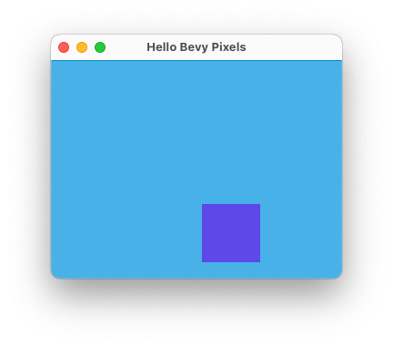

<div align="center">
  <h1>
    <br />
    bevy_pixels
  </h1>
  <p>
    <strong>
      <a href="https://github.com/bevyengine/bevy">Bevy</a> plugin that uses
      <a href="https://github.com/parasyte/pixels">Pixels</a> (a tiny pixel buffer) for rendering
    </strong>
  </p>
  <p>
    <a href="https://crates.io/crates/bevy_pixels">
      
    </a>
    <a
      href="https://github.com/bevyengine/bevy/blob/main/docs/plugins_guidelines.md#main-branch-tracking"
    >
      
    </a>
  </p>
</div>

## Usage

Add `bevy` and `bevy_pixels` to `Cargo.toml`. Be sure to disable `bevy`'s `render` and `bevy_wgpu` features (with `default-features = false`) as they will conflict with rendering provided by `bevy_pixels`.

```toml
[dependencies]
bevy = { version = "0.5", default_features = false }
bevy_pixels = "0.1"
```

Add `PixelsPlugin` to your Bevy project.

```rust
use bevy::prelude::*;
use bevy_pixels::prelude::*;

fn main() {
    App::build()
        .add_plugins(DefaultPlugins)
        .add_plugin(PixelsPlugin)
        .add_system(main_system.system())
        .run();
}
```

Use `PixelsResource` in your systems.

```rust
fn main_system(mut pixels_resource: ResMut<PixelsResource>) {
    // Get a mutable slice for the pixel buffer
    let frame: &mut [u8] = pixels_resource.pixels.get_frame();

    // Fill frame with pixel data
    // ...
}
```

## Bevy Version Supported

| bevy | bevy_pixels |
| ---- | ----------- |
| 0.5  | 0.1         |

## Examples

### [Hello Bevy Pixels](https://github.com/dtcristo/bevy_pixels/blob/main/examples/minimal.rs)

This example is based off [`minimal-winit`](https://github.com/parasyte/pixels/tree/master/examples/minimal-winit) example from the pixels project.

```sh
cargo run --release --example minimal
```



## Todo

- Add more configuration around how rendering is performed.
- Add support for multiple windows.
